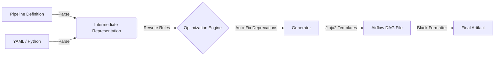

# PYTHON_TO_DAG

[](https://github.com/GeonYul2/Python_to_DAG/actions/workflows/ci.yml)


> **Infrastructure as Code for Airflow DAGs**
>
> 파이프라인을 Python/YAML로 정의하면, 운영 가능한 Airflow 3.x Native DAG가 자동으로 생성됩니다.

---

## 🚀 왜 이 프로젝트가 필요한가요?

수동으로 DAG를 작성하면 암묵적인 의존성, 구버전 패턴 사용, 로깅 누락 같은 문제가 반복됩니다.
**PYTHON_TO_DAG**은 DAG를 소스 코드가 아닌 **컴파일 산출물(Artifact)** 로 취급하여 이 문제를 해결합니다.

*   **보일러플레이트 제거**: Airflow import나 클래스 정의가 아닌, **비즈니스 로직(입/출력)** 에만 집중하세요.
*   **표준 강제**: 멱등성(Idempotency), 재시도(Retries), 표준 로깅(Correlation ID)이 자동으로 적용됩니다.
*   **미래 호환성**: Airflow 2에서 3으로(혹은 그 이후로) 넘어갈 때, 100개의 DAG 파일을 고치는 대신 **생성기 하나만 업데이트**하면 됩니다.
*   **친절한 문서화**: 생성된 DAG에는 어린아이도 이해할 수 있는 **Kindergarten Guide** 주석이 자동으로 포함되도록 권장합니다.

## ✨ 주요 기능

### 🌪️ Airflow 3 Native
최신 스택을 위해 설계되었습니다. **Airflow 3.x** 표준을 완벽하게 준수하는 코드를 생성합니다:
*   최신 `schedule` 파라미터 사용 (`schedule_interval` 제거됨).
*   `airflow.providers.standard` 및 `airflow.sdk` 통합.
*   **Airflow 3.1.6 (Stable)** 환경에서 검증 완료.

### 🛡️ 자동화된 품질 게이트 (Automated Quality Gates)
깨진 코드는 절대 배포되지 않습니다. CI 파이프라인이 다음을 강제합니다:
*   **Pre-Gate**: 단위 테스트, 스키마 검증, Rewrite 규칙 검사.
*   **Post-Gate**: 실제 Airflow 3 환경에서 `DagBag` import 검증.
*   **Golden Tests**: 승인된 DAG 스냅샷과 비트 단위(Bit-level) 회귀 테스트 수행.

### 🔌 타입 안전한 정의 (Type-Safe Definitions)
원하는 방식으로 파이프라인을 정의하세요. 구조는 유지됩니다.
*   **YAML**: 데이터 엔지니어링을 위한 빠르고 선언적인 Low-code 인터페이스.
*   **Python IR**: 동적 파이프라인 생성을 위한 타입 안전한 중간 표현(Intermediate Representation).

---

## 🏗️ 아키텍처 (Architecture)

이 시스템은 **입력 → 엔진 → 생성기**의 엄격한 흐름을 따릅니다:



1.  **입력 (Input)**: 단순화된 YAML/Python 정의.
2.  **엔진 (Engine)**: 데이터를 정규화하고, 연산자를 최신화(예: `Dummy` -> `Empty`)하며, Airflow 3 규칙을 적용합니다.
3.  **생성기 (Generator)**: 검증된 템플릿을 사용하여 표준 Python 코드를 렌더링합니다.
4.  **검증 (Verification)**: CI가 생성된 코드의 import 가능 여부와 유효성을 보장합니다.

---

## ⚡ 퀵스타트 (Quick Start)

### 1. 요구 사항
*   Python 3.11+
*   Airflow 3.x (생성된 DAG 실행용)

### 2. 파이프라인 정의
`pipelines/yaml/my_pipeline.yaml` 생성:

```yaml
pipeline_id: "my_first_pipeline"
schedule: "@daily"
default_args:
  owner: "data_team"
  retries: 3

tasks:
  - task_id: "extract"
    task_type: "PythonOperator"
  
  - task_id: "load"
    task_type: "PythonOperator"
    upstream_task_ids: ["extract"]
```

### 3. DAG 생성
빌더 CLI 실행:

```bash
# 모든 YAML 파일로부터 DAG 생성
python -m python_to_dag build --input pipelines/yaml/my_pipeline.yaml --out dags/
```

### 4. 확인
`dags/pipeline__my_first_pipeline.py`에 생성된 코드를 확인하세요. 바로 배포 가능합니다!

---

## 📂 프로젝트 구조

```text
.
├── dags/                       # 🏭 생성된 Airflow DAG (절대 수동 수정 금지)
├── pipelines/                  # 📝 소스 오브 트루스 (파이프라인 정의)
│   ├── python/                 # Python DSL 정의
│   └── yaml/                   # YAML 정의
├── src/
│   ├── python_to_dag/          # ⚙️ 핵심 엔진 (파서, 리라이터, 생성기)
│   └── airflow_templates/      # 🎨 Jinja2 DAG 템플릿
├── docs/                       # 📚 설계 명세 및 계약
│   ├── airflow_dag_guidelines.md
│   └── CI_CONTRACT.md
└── tests/                      # 🧪 검증/테스트 스위트
```

## 🤝 기여 가이드 (Contribution)

*   **Antigravity**: 구현, 통합, 테스트 담당.
*   **User/Architect**: 명세(Spec), 요구사항 정의, 리뷰 담당.

상세 규칙은 [CI Contract](docs/CI_CONTRACT.md) 및 [Airflow Guidelines](docs/04_airflow_dag_guidelines.md)를 참고하세요.