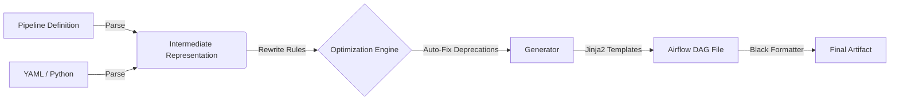

# PYTHON_TO_DAG

[](https://github.com/GeonYul2/Python_to_DAG/actions/workflows/ci.yml)


> **Infrastructure as Code for Airflow DAGs**
>
> Define pipelines in Python/YAML. Generate production-grade, Airflow 3.x native DAGs automatically.

---

## 🚀 Why This Project?

Manual DAG authoring is prone to errors: implicit dependencies, deprecated patterns, and inconsistent logging.
**PYTHON_TO_DAG** solves this by treating DAGs as compilation artifacts, not source code.

*   **Eliminate Boilerplate**: Focus on business logic (Inputs/Outputs), not Airflow imports and classes.
*   **Enforce Standards**: Automatically apply idempotency, retries, and logging correlation IDs.
*   **Future-Proof**: Migrate from Airflow 2 to 3 (or future versions) by updating the generator, not 100+ DAG files.

## ✨ Key Features

### 🌪️ Airflow 3 Native
Built for the modern stack. Generates code compliant with **Airflow 3.x** standards:
*   Uses the latest `schedule` parameter (deprecated `schedule_interval` removed).
*   Integrates `airflow.providers.standard` and `airflow.sdk`.
*   Verified against Airflow 3.1.6 (Stable).

### 🛡️ Automated Quality Gates
Your code never breaks the build. The CI pipeline enforces:
*   **Pre-Gate**: Unit tests, Schema validation, Rewrite rules check.
*   **Post-Gate**: `DagBag` import verification in a real Airflow 3 environment.
*   **Golden Tests**: Bit-level regression testing against approved DAG snapshots.

### 🔌 Type-Safe Definitions
Define pipelines your way, but keeps it structured.
*   **YAML**: Declarative, low-code interface for rapid data engineering.
*   **Python IR**: Type-safe Intermediate Representation for dynamic pipeline generation.

---

## 🏗️ Architecture

The system follows a strict **Input → Engine → Generator** flow:



1.  **Input**: Simple YAML/Python definition.
2.  **Engine**: Normalizes data, upgrades operators (e.g., `Dummy` -> `Empty`), and applies Airflow 3 rules.
3.  **Generator**: Renders standard Python code using verified templates.
4.  **Verification**: CI ensures the generated code is importable and valid.

---

## ⚡ Quick Start

### 1. Requirements
*   Python 3.11+
*   Airflow 3.x (for running generated DAGs)

### 2. Define a Pipeline
Create `pipelines/yaml/my_pipeline.yaml`:

```yaml
pipeline_id: "my_first_pipeline"
schedule: "@daily"
default_args:
  owner: "data_team"
  retries: 3

tasks:
  - task_id: "extract"
    task_type: "PythonOperator"
  
  - task_id: "load"
    task_type: "PythonOperator"
    upstream_task_ids: ["extract"]
```

### 3. Generate DAG
Run the builder CLI:

```bash
# Generate DAGs from all YAML files
python -m python_to_dag build --input pipelines/yaml/my_pipeline.yaml --out dags/
```

### 4. Verify
Check the generated code in `dags/pipeline__my_first_pipeline.py`. It's ready to deploy!

---

## 📂 Project Structure

```text
.
├── dags/                       # 🏭 Generated Airflow DAGs (DO NOT EDIT MANUALLY)
├── pipelines/                  # 📝 Source of Truth (Definitions)
│   ├── python/                 # Python DSL definitions
│   └── yaml/                   # YAML definitions
├── src/
│   ├── python_to_dag/          # ⚙️ Core Engine (Parser, Rewriter, Generator)
│   └── airflow_templates/      # 🎨 Jinja2 DAG Templates
├── docs/                       # 📚 Specifications & Contracts
│   ├── airflow_dag_guidelines.md
│   └── CI_CONTRACT.md
└── tests/                      # 🧪 Validation Suite
```

## 🤝 Contribution

*   **Antigravity**: Implementation, Integration, Testing.
*   **User/Architect**: Specification, Requirement Definition, Review.

For detailed rules, see [CI Contract](docs/CI_CONTRACT.md) and [Airflow Guidelines](docs/04_airflow_dag_guidelines.md).